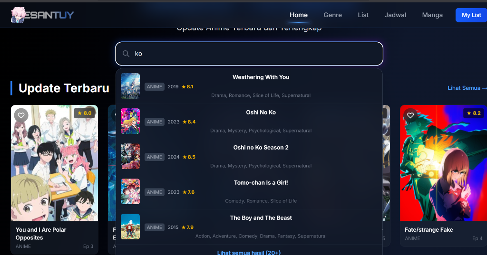
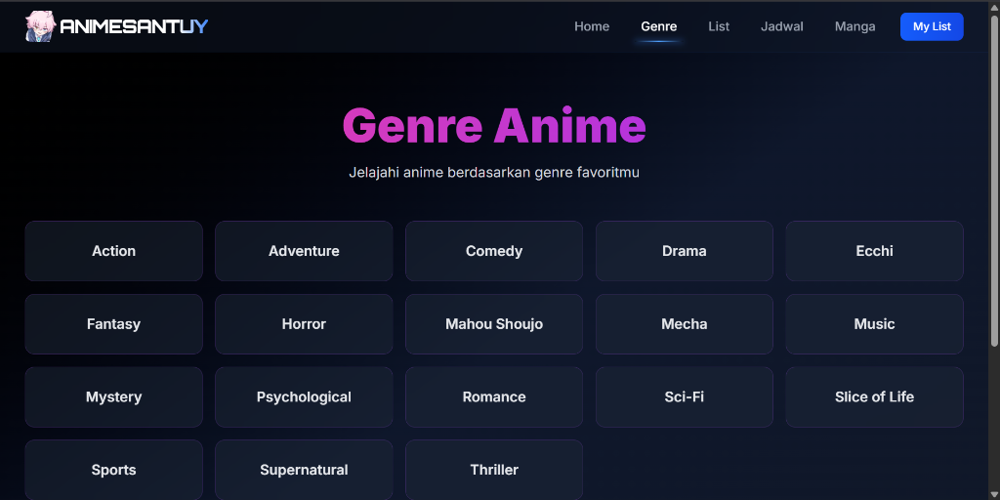
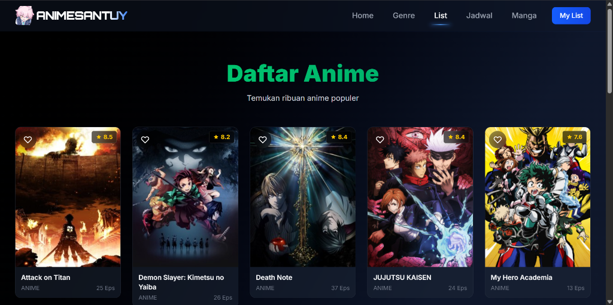
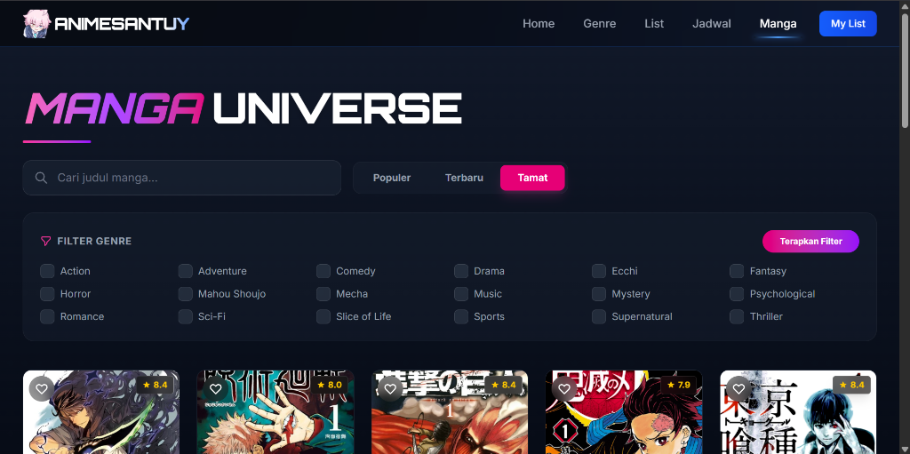
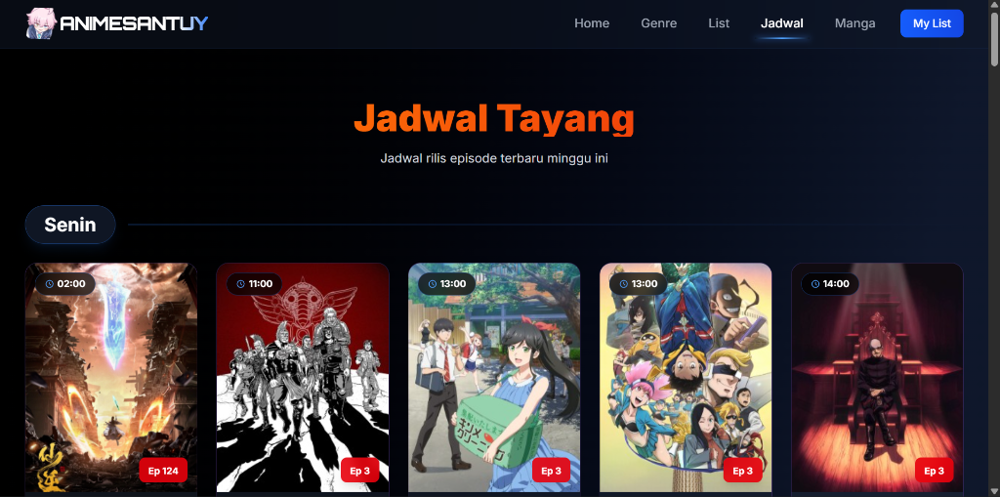

<div align="center">


# 🎌 Anime Santuy

**Temukan dan Jelajahi Anime Favorit Kamu!**

[](https://laravel.com)
[](https://php.net)
[](https://tailwindcss.com)
[](LICENSE)


</div>

---

## 📋 Daftar Isi

- [✨ Fitur](#-fitur)
- [🛠️ Teknologi](#️-teknologi)
- [📦 Prasyarat](#-prasyarat)
- [🚀 Instalasi & Setup](#-instalasi--setup)
- [⚙️ Konfigurasi](#️-konfigurasi)
- [🎨 Setup Tailwind CSS](#-setup-tailwind-css)
- [🧪 Testing](#-testing)
- [📸 Screenshot](#-screenshot)
- [🤝 Kontribusi](#-kontribusi)
- [📄 Lisensi](#-lisensi)

---

## ✨ Fitur

🎯 **Fitur Utama:**

- 📺 **Home Page**: Menampilkan Anime Terbaru, Populer, dan Tamat dengan tampilan modern.
- 🔍 **Live Search**: Cari anime dengan cepat, lengkap dengan loading indicator animasi.
- 📜 **Daftar Anime (Infinite Scroll)**: Jelajahi ribuan anime dengan fitur _load more_ tanpa reload halaman.
- 📅 **Jadwal Tayang**: Cek jadwal rilis episode terbaru setiap harinya.
- 📚 **Manga Universe**: Jelajahi ribuan koleksi manga dengan fitur search, kategori, dan filter multi-genre.
- ❤️ **My List**: Simpan anime dan manga favorit kamu dalam koleksi pribadi (LocalStorage).
- 🎨 **Modern UI**: Desain responsif dan estetis menggunakan Tailwind CSS.
- 🌙 **Dark Mode**: Tampilan yang nyaman di mata.

---

## 🛠️ Teknologi

| Kategori       | Teknologi                      |
| -------------- | ------------------------------ |
| **Framework**  | Laravel 11.x                   |
| **Frontend**   | Blade Templates + Tailwind CSS |
| **Database**   | MySQL / PostgreSQL             |
| **API**        | Jikan API (MyAnimeList)        |
| **Build Tool** | Vite                           |

---

## 📱 Preview Aplikasi

Berikut adalah tampilan dari aplikasi Anime Santuy:

<div align="center">

### 🏠 Halaman Utama (Home)



### 🧩 Genre Anime



### 📜 Daftar Anime (List)



### 📚 Manga Universe



### 📅 Jadwal Tayang (Schedule)



</div>

---

## 📦 Prasyarat

Pastikan sistem kamu sudah terinstall:

- ✅ PHP >= 8.2
- ✅ Composer
- ✅ Node.js & npm (v18 atau lebih baru)
- ✅ MySQL / PostgreSQL (opsional)
- ✅ Git

---

## 🚀 Instalasi & Setup

### 1️⃣ Clone Repository

```bash
git clone https://github.com/username/anime-santuy.git
cd anime-santuy
```

### 2️⃣ Install Dependencies

```bash
composer install
```

### 3️⃣ Install Dependencies Node.js

```bash
npm install
```

### 4️⃣ Setup File Environment

Salin file `.env.example` menjadi `.env`:

```bash
# Windows (PowerShell)
copy .env.example .env

# Linux / macOS
cp .env.example .env
```

### 5️⃣ Generate Application Key

```bash
php artisan key:generate
```

> **💡 Penting:** Perintah ini akan menghasilkan `APP_KEY` yang unik untuk aplikasi kamu. Key ini digunakan untuk enkripsi data.

### 6️⃣ Konfigurasi Database (Opsional)

Edit file `.env` dan sesuaikan konfigurasi database jika diperlukan:

```env
DB_CONNECTION=mysql
DB_HOST=127.0.0.1
DB_PORT=3306
DB_DATABASE=anime_santuy
DB_USERNAME=root
DB_PASSWORD=
```

### 7️⃣ Jalankan Database Migrations (Opsional)

```bash
php artisan migrate
```

Opsional - Isi database dengan data anime sample:

```bash
php artisan db:seed
```

---

## ⚙️ Konfigurasi

### 🔑 Setup API

Edit file `.env` dan tambahkan URL Jikan API:

```env
# Jikan API (MyAnimeList)
ANIME_API_URL=https://api.jikan.moe/v4
```

> **📝 Catatan:**
>
> - **Jikan API** tidak memerlukan API key dan gratis untuk digunakan
> - API ini menyediakan data lengkap dari MyAnimeList

---

## 🎨 Setup Tailwind CSS

### 1️⃣ Install Tailwind CSS

Tailwind CSS sudah termasuk dalam `package.json`. Jalankan:

```bash
npm install tailwindcss@next @tailwindcss/vite@next
```

> **📝 Catatan:** Project ini menggunakan **Tailwind CSS v4.1** yang memiliki syntax baru dan lebih simpel!

### 2️⃣ Konfigurasi di app.css

File `resources/css/app.css` menggunakan syntax Tailwind v4.1:

```css
@import "tailwindcss";

@source '../../vendor/laravel/framework/src/Illuminate/Pagination/resources/views/*.blade.php';
@source '../../storage/framework/views/*.php';
@source '../**/*.blade.php';
@source '../**/*.js';
```

> **✨ Kelebihan Tailwind v4.1:**
>
> - Tidak perlu `tailwind.config.js` lagi
> - Lebih cepat dan efisien
> - Syntax lebih sederhana dengan `@import` dan `@source`

### 4️⃣ Build Assets

Untuk development (dengan hot reload):

```bash
npm run dev
```

Untuk production build:

```bash
npm run build
```

---

## 🏃 Menjalankan Aplikasi

### Development Server

```bash
php artisan serve
```

Aplikasi akan berjalan di: **http://localhost:8000**

### Dengan Vite Dev Server (untuk hot reload CSS/JS)

Di terminal pertama:

```bash
php artisan serve
```

Di terminal kedua:

```bash
npm run dev
```

---

## 🧪 Testing

### Jalankan Tests

```bash
php artisan test
```

### Test API Endpoints

Test koneksi Jikan API:

```bash
# Buka di browser atau curl
http://localhost:8000/test-jikan
```

Test konfigurasi service:

```bash
# Buka di browser
http://localhost:8000/dump-anime-url
```

## 📁 Struktur Proyek

```
anime-santuy/
├── app/
│   ├── Http/Controllers/      # Controllers
│   ├── Models/                 # Eloquent Models
│   ├── Services/               # Business Logic
│   └── Helpers/                # Helper Classes
├── config/                     # File Konfigurasi
├── database/                   # Migrations & Seeders
├── public/                     # Public Assets
├── resources/
│   ├── css/                    # Stylesheets
│   ├── js/                     # JavaScript
│   └── views/                  # Blade Templates
├── routes/                     # Definisi Routes
└── tests/                      # File Testing
```

---

## 🐛 Troubleshooting

### Port 8000 sudah digunakan?

```bash
php artisan serve --port=8080
```

### CSS tidak muncul?

Pastikan Vite dev server berjalan:

```bash
npm run dev
```

### Database connection error?

Periksa konfigurasi database di `.env` and pastikan MySQL/PostgreSQL sudah berjalan.

### Error saat mengakses Jikan API?

Jikan API memiliki rate limit. Tunggu beberapa saat jika terlalu banyak request.

---

## 🤝 Kontribusi

Kontribusi sangat diterima! Berikut caranya:

1. Fork repository ini
2. Buat branch feature (`git checkout -b feature/FiturKeren`)
3. Commit perubahan (`git commit -m 'Tambah fitur keren'`)
4. Push ke branch (`git push origin feature/FiturKeren`)
5. Buat Pull Request

---

## 📝 To-Do List

- [ ] Tambah fitur autentikasi user
- [ ] Implementasi watchlist/favorites
- [ ] Sistem rating anime
- [ ] Filter pencarian advanced
- [ ] Versi mobile app
- [ ] Integrasi dengan platform streaming

---

## 📄 Lisensi

Project ini menggunakan lisensi **MIT License** - lihat file [LICENSE](LICENSE) untuk detail.

---

## 👨‍💻 Author

**Resya Anggara**

- GitHub: [@resyaanggara](https://github.com/resyaanggara)
- Email: resya@example.com

---

<div align="center">

### ⭐ Kasih bintang repo ini kalau kamu suka!

**Dibuat dengan ❤️ dan Laravel**


_Happy Coding! 🚀_

</div>
